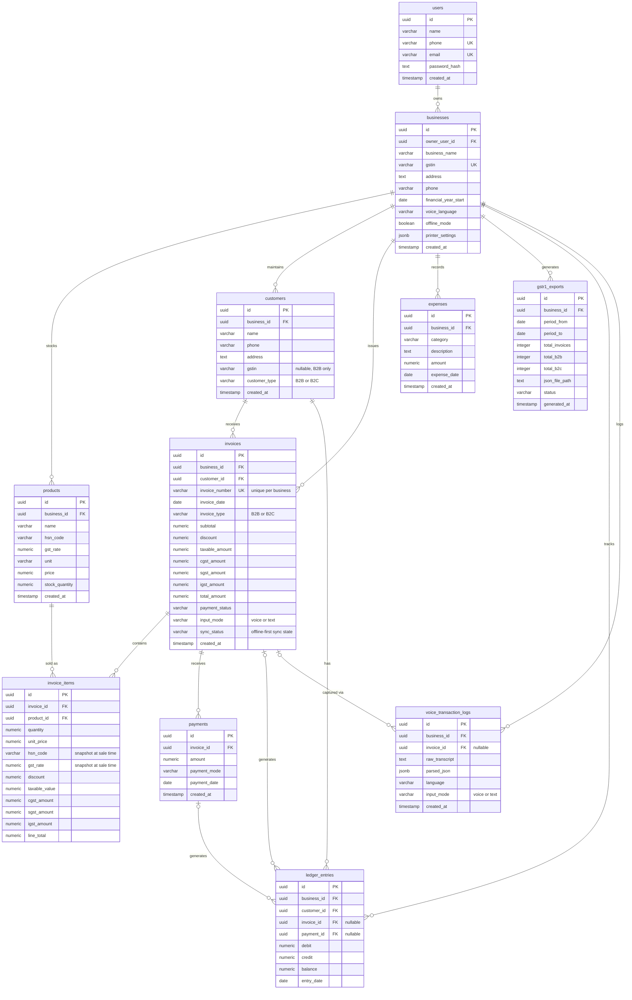

# GST Voice Billing App — Database Schema (ER Diagram)

Target stack: PostgreSQL on Neon (serverless) · offline-first mobile client syncing to this schema.

## Notes

- Reports, Profit & Loss, and Balance Sheet screens are computed views over `invoices`, `invoice_items`, `expenses`, `ledger_entries`, and `products.stock_quantity` — not separate stored tables.
- `ledger_entries.invoice_id` and `ledger_entries.payment_id` are both nullable; each row originates from exactly one of: an invoice (debit), a payment (credit), or a manual adjustment (both null).
- UUID primary keys throughout (not serial/identity) to avoid ID collisions when offline-created records sync from the mobile client to Neon.
- `invoices.invoice_number` is unique per `business_id`, not globally.
- `invoice_items.hsn_code` / `gst_rate` snapshot the product's values at sale time, since `products.gst_rate` can change later and past invoices must keep their original rate.
- `invoices.sync_status` and `voice_transaction_logs` support the offline-first flow: local SQLite writes queue up and sync to Neon Postgres when connectivity returns.
